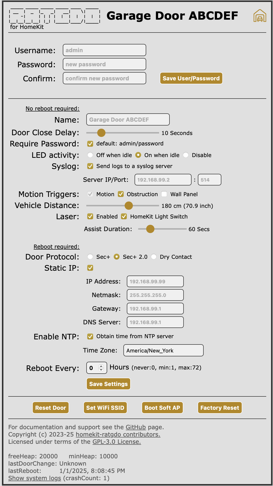
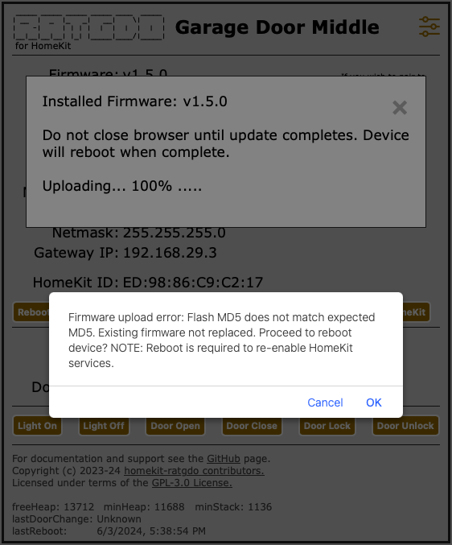
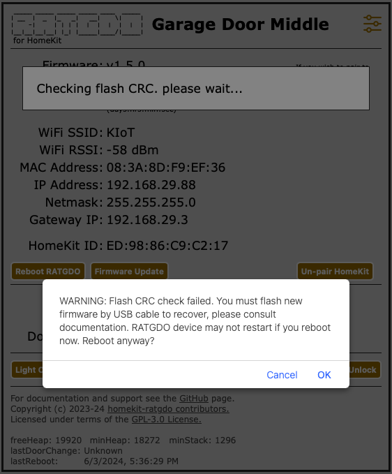
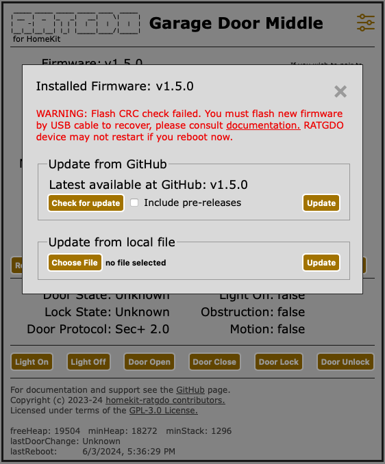

# What is HomeKit-RATGDO?

HomeKit-RATGDO is an alternative firmware for the RATGDO v2.5-series WiFi control boards that works
over your _local network_ using HomeKit, or over the internet using your Apple HomeKit home hubs, to
control your garage door opener. It requires no supporting infrastructure such as Home Assistant,
Homebridge, MQTT, etc, and connects to your garage door opener with as few as three wires.

This firmware supports Security+ and Security+ 2.0 enabled garage door openers and RATGDO v2.5-series
ESP8266-based hardware.

> [!NOTE]
> Many thanks to the original author @thenewwazoo.

## What does this firmware support?

* Opening and closing multiple garage doors independently in the same HomeKit home.
* Light Control and Status
* Obstruction sensor reporting
* Motion sensor reporting, if you have a "smart" wall-mounted control panel.

That's it, for now. Check the [GitHub Issues](https://github.com/ratgdo/homekit-ratgdo/issues) for
planned features, or to suggest your own.

## How do I install it?

> [!NOTE]
> The installation process is still being improved. You may need to reload the flasher tool page
> after each of the following steps in order to proceed.

For each of the following steps, use the [online browser-based flash tool](https://ratgdo.github.io/homekit-ratgdo/flash.html):

* Install the HomeKit-RATGDO firmware, and then *wait 20 seconds*.
* Connect the RATGDO to WiFi
* Click "Visit Device", and then begin the process of adding a device to HomeKit. Scan the QR code,
  or manually enter the setup code `2510-2023`.

That's it!

## Using ratgdo Webpage

Before pairing to HomeKit / Apple Home you should open up the ratgdo webpage and configure basic settings.  Simply enter the local IP address of the ratgdo device to access the settings page to set a more appropriate device name and check that your door protocol is correct.

[](#webpage)

The webpage comprises three sections, HomeKit and ratgdo device status, garage door opener status, and an information and diagnostic section.

### HomeKit and ratgdo status

If you ratgdo device is not yet paired to HomeKit then a QR code is displayed for you to scan and add the garage door to HomeKit. If the device is already paired then this is replaced with a statement that you must first un-pair the device if you wish to use it with another HomeKit home.  A Reset or Un-pair HomeKit button is provided for this.

> [!NOTE]
> if you will re-pair to the same HomeKit home you must also delete the accessory from HomeKit as well as un-pairing at the ratgdo device.

This section also displays the current firmware version, with a statement on whether an update is available, the uptime of the device in days/hours/minutes/seconds and WiFi connection status.

### Garage door opener status

Status of the garage door along with action buttons are shown in this section.  The status values are updated in real time whether triggered by one of the action buttons or an external action (motion in the garage, someone using a door remote).

### Information section

The final section provides useful links to documentation and legal/license information.  At the very bottom of the page is diagnostic information, see Troubleshooting section below.

### Authentication

By default authentication is not required for any action on this web page.  However it is strongly recommended that you enable the setting to require a password and change the default. If authentication is enabled then all buttons _except_ Reboot are protected with a username and password

#### Default Username/Password: `admin`/`password`

> [!NOTE]
> The device uses _Digest Authentication_ supported in all web browsers, this is not cryptographically secure but is sufficient to protect against unauthorized or inadvertant access. Note that web browsers remember the username and password for a period of time so you will not be prompted to authenticate for every access.

You can change the default password by clicking into the settings page:

[](#settings)

## Settings Webpage

[](#password)

The settings page allows you to input a new password (but username cannot be changed, it is always _admin_). Saving a new password will return you to the main webpage from which point you will have to authenticate with the new password to access the settings page or any of the action buttons (except for reboot).

When you save settings from this page the ratgdo device will either return immediately to the main page or, if required, reboot return to the main page and after a 30-second countdown.

### Name

This updates the name reported to HomeKit and for mDNS device discovery.  The default name is _Garage Door ABCDEF_ where the last 6 characters are set to the MAC address of the ratgdo device. Changing the name after pairing with HomeKit does not change the name within HomeKit or Apple Home.

### Door Close Delay

You can select up-to 60 second delay before door starts closing. During the delay period the garage door lights will flash and you may hear the relay clicking, but there is no audible beep.

### Require Password

If selected then all the action buttons _except reboot_, and access to the settings page, will require authentication.  Default is not required.

### Receive Logs

This option is not available on mobile devices. On a desktop browser all server firmware logs can be displayed in the javascript console log. On some browsers you may need to enable developer mode before you can open the javascript console.

### Door Protocol

Set the protocol for your model of garage door opener.  This defaults to Security+ 2.0 and you should only change this if necessary.

### WiFi Version

If the device faile to connect reliably and consistently to your WiFi network it may help to lock it to a specific WiFi version. The ratgdo supports 802.11b, 802.11g and 802.11n on the 2.4GHz WiFi band and by default will auto-select. If it helps in your network, select the specific version you wish to use.  Note: If you select a version that your network does not support then the ratgdo will revert to auto-select and reboot itself after 30 seconds.

### WiFi Tx Power

You can set the WiFi transmit power to between 0 and 20 dBm. It defaults to the maximum (20.5 dBm, displayed as 20 dBm) but you may wish to fine tune this to control how the device connects to available WiFi access points.

### Reboot Every

During early devlopment there were several reports that the ratgdo device would reset itself and loose its pairing with HomeKit. To reduce the chance of this occuring a regular (e.g. daily) reboot of the device provided a work-around. The firmware is far more stable now and it is hoped that this is no longer required. This setting may be removed in future versions.

## How do I upgrade?

Over-the-Air (OTA) updates are supported, either directly from GitHub or by selecting a firmware binary file on your computer. Follow the steps below to update:

* Navigate to your ratgdo's ip address where you will see the devices webpage, Click `Firmware Update`
  > When you open Firmware Update the ratgdo device performs a flash memory CRC check. If this fails a warning message is shown. Please see the Flash CRC Errors section below before proceeding.

[](#ota)
* Update from Github
  * To check for updates, click `Check for update`.
    Select the _Include pre-releases_ box to include pre- or beta-release versions in the check. 
  * If update is available, Click `Update`.
* Update from local file.
  * Download the latest release, by download the `.bin` file from the [latest release](https://github.com/ratgdo/homekit-ratgdo/releases) page.
[](#firmware)
  * Upload the firmware that was downloaded in step 1, by clicking `Choose File` under `Update from local file`.
  * Click `Update` to proceed with upgrading.
  * Once the update is Successful, ratgdo will now Reboot.
  * After a firmware update, you _may_ have to go through the process of re-pairing your device to HomeKit.  If your device is showing up as unresponsive in HomeKit, please try un-pairing, reboot, and re-pairing.

Automatic updates are not supported (and probably will never be), so set a reminder to check back again in the future.

## Upgrade failures

If the OTA firmware update fails the following message will be displayed and you are given the option to reboot or cancel. If you reboot, the device will reload the same firmware as previously installed.  If you cancel then the device remains open, but the HomeKit service will be shutdown.  This may be helpful for debuging, see Troubleshooting section below.

[](#updatefail)

## Flash CRC Errors

When requesting a reboot or displaying the firmware update dialog, the integrity of the ratgdo device is checked by running a CRC check on the flash memory. A CRC error is a strong indicator of a problem in the ratgdo firmware and it is highly likely that the device will fail to reboot.

[](#rebootcrc)
[](#updatecrc)

If you encounter a flash CRC error then please [open an issue](https://github.com/ratgdo/homekit-ratgdo/issues) on GitHub so that developers can assist with debugging.  Recovering from a flash CRC error will require flashing new firmware using a USB cable, but it may be possible to capture valuable information using esptool to assist with debugging.

### esptool

[Espressif](https://www.espressif.com) publishes [esptool](https://docs.espressif.com/projects/esptool/en/latest/esp8266/index.html), a command line utility built with python.  Esptool requires that you connect a USB serial cable to the ratgdo device. If you are able to install and run this tool then the following commands may be useful...

```
sudo python3 -m esptool -b 115200 -p <serial_device> verify_flash --diff yes 0x0000 <firmware.bin>
```
The above command verifies that the flash memory on the ratgdo has an exact image of the contents of the provided firmware binary file. If a flash CRC error was reported then this command will fail and list out the memory locations that are corrupt. This information will be useful to the developers to assist with debugging. Please copy it into the GitHub issue.

```
sudo python3 -m esptool -b 115200 -p <serial_device> write_flash 0x0000 <firmware.bin>
```
The above command will upload a new firmware binary file to the ratgdo device which will recover from the flash CRC error. This is an alternative to using the [online browser-based flash tool](https://ratgdo.github.io/homekit-ratgdo/flash.html) described above.

Replace _<serial_device>_ with the identifier of the USB serial port.  On Apple MacOS this will be something like _/dev/cu.usbserial-10_ and on Linux will be like _/dev/ttyUSB0_. You should not use a baud rate higher than 115200 as that may introduce serial communication errrors.

## Command Line Interface

It is possibile to query status, monitor and reboot/reset the ratgdo device from a command line.  The following have been tested on Ubuntu Linux and Apple macOS.

### Retrieve ratgdo status

```
curl -s http://<ip-address>/status.json
```
Status is returned as JSON formatted text.

### Reboot ratgdo device

```
curl -s -X POST http://<ip-address>/reboot
```
Allow at least 30 seconds for the device to reboot before attempting to reconnect.

### Reset ratgdo device

```
curl -s -X POST http://<ip-address>/reset
```
Resets and reboots the device. This will delete HomeKit pairing.
> [!NOTE]
> Will not work if device set to require authentication

### Show last crash log

```
curl -s http://<ip-address>/crashlog
```
Returns details of the last crash including stack trace and the message log leading up to the crash

### Clear crash log

```
curl -s http://<ip-address>/clearcrashlog
```
Erase contents of the crash log

### Show message log

```
curl -s http://<ip-address>/showlog
```
Returns recent history of message logs.

### Show last reboot log

```
curl -s http://<ip-address>/showrebootlog
```
Returns log of messages that immediately preceeded the last clean reboot (e.g. not a crash or power failure).
> [!NOTE]
> This may be older than the most recent crash log.

### Monitor message log

The following script is available in this repository as `viewlog.sh`
```
UUID=$(uuidgen)
URL=$(curl -s "http://${1}/rest/events/subscribe?id=${UUID}&log")
curl -s "http://${1}/showlog"
curl -s -N "http://${1}${URL}?id=${UUID}" | sed -u -n '/event: logger/{n;p;}' | cut -c 7-
```
Run this script as `<path>/viewlog.sh <ip-address>`

Displays recent history of message log and remains connected to the device.  Log messages are displayed as they occur.
Use Ctrl-C keystroke to terminate and return to command line prompt. You will need to download this script file from github.

### Upload new firmware

> [!WARNING]
> This should be used with extreme caution, updating from USB serial or web browser is strongly preferred.  Before using this script you should check that embedded commands like `md5` or `md5sum` and `stat` work correctly on your system. Monitoring the message log (see above) is recommended and no other browser should be connected to the ratgdo device.
```
<path>/upload_firmware.sh <ip-address> <firmware_file.bin>
```
Uploads a new firmware binary file to the device and reboots.  It can take some time to complete the upload, you can monitor progress using the `viewlog.sh` script in a separate command line window. You will need to download this script file from github.
> [!NOTE]
> Will not work if device set to require authentication

## Help! aka the FAQs

### How can I tell if the ratgdo is paired to HomeKit?

Use the [online browser-based flash tool](https://ratgdo.github.io/homekit-ratgdo/flash.html), and follow the
"Visit Device" link. If you see a big QR code, the ratgdo is _not_ paired.

### I added my garage door in the Home app but can't find it

This is a common problem. Be sure to check all of the "rooms" in the Home app. If you really can't
find it, you can try un-pairing and re-pairing the device, paying close attention to the room you
select after adding it.

### Unable to Pair

I get a message [Unable to Add Accessory: The setup code is incorrect.](https://github.com/ratgdo/homekit-ratgdo/issues/97)

> [!WARNING]
We have had a number of users that have encountered this error that was a result of running HomeBridge with the Bounjour-HAP mDNS backend. You can find
more details in the issue thread, but the short story is to consider changing that backend to Avahi or Ciao.

### How do I re-pair my ratgdo?

Use the [online browser-based flash tool](https://ratgdo.github.io/homekit-ratgdo/flash.html), and follow the
"Visit Device" link. If you see a big QR code, the ratgdo is *not* paired. Click the _Reset HomeKit_ or _Un-pair
HomeKit_ button, and then delete the garage door from within the HomeKit app (or vice versa, order
does not matter). Reseting or Un-pairing HomeKit will cause the ratgdo device to reboot.  You can then re-pair the
device by adding it again as normal.

### Where can I get help?

If your question has not been answered here, you can try the Discord chat.

Click [this link](https://discord.gg/homebridge-432663330281226270) to follow an invite to the
server. Server rules require a 10 minute wait after signup.

Now that you've signed up, go here to join the discussion:

[](https://discord.com/channels/432663330281226270/1184710180563329115).

Please also feel free to open a [GitHub Issue](https://github.com/ratgdo/homekit-ratgdo/issues) if
you don't already see your concern listed. Don't forget to check the [closed
issues](https://github.com/ratgdo/homekit-ratgdo/issues?q=is%3Aissue+is%3Aclosed) to see if someone
has already found a fix.

## Troubleshooting

Great reliability improvements have been made in recent versions of the firmware, but it is possible that things can still go wrong. As noted above you should check that the door protocol is correctly set and if WiFi connection stability is suspected then you select a specific WiFi version.

The footer of the webpage displays useful information that can help project contributors assist with diagnosing a problem. The ESP8266 is a low-memory device so monitoring actual memory usage is first place to start. Whenever you connect to the webpage, the firmware reports memory utilization every second... current available free heap, the lowest value that free heap has reached since last reboot, and the minimum available stack reached since last reboot.

In addition the last reboot date and time is reported (calculated by subtracting up-time from current time). If the last reboot was caused by a system crash then an additonal line will display the number of times it crashed with options to display the crash log, and to clear the crash log.

The _lastDoorChange_ will show the date and time that the door was last opened or closed.  This is not saved across reboots, so it will show as unknown after a reboot.

### Display log

If this appears then please click on the link. A new browser tab will open with details of the crash. If you open an issue on GitHub then please copy/paste this into the issue.

### Clear log

Once you have made a copy of the crash log, you should clear it so there is sufficient space to capture future crashes. Clearing the log requires authentication (only if _require password_ selected) but will not reboot the device.

## How can I contribute?

HomeKit-RATGDO uses [PlatformIO](https://platformio.org/platformio-ide) for builds. You'll want to
install PlatformIO first.

After you've checked out this repo:

```
git clone git@github.com:ratgdo/homekit-ratgdo.git
```

Initialize the submodules from the root of the repo:

```
cd homekit-ratgdo
git submodule init lib/secplus/
git submodule update
```

The [`x.sh`](https://github.com/ratgdo/homekit-ratgdo/blob/main/x.sh) script is my lazy way of not
having to remember PlatformIO-specific `pio` commands. The important ones are `run`, `upload`, and
`monitor`.

## Who wrote this?

This firmware was written by [Brandon Matthews](https://github.com/thenewwazoo), with lots of
inspiration from the [esphome-ratgdo](https://github.com/ratgdo/esphome-ratgdo) project and critical
dependence on the [secplus decoder library](https://github.com/argilo/secplus).

Ongoing reliability improvements by [Jonathan Stroud](https://github.com/jgstroud/), and webpage design and implementation by [David Kerr](https://github.com/dkerr64)

Special credit goes to the Chamberlain Group, without whose irredeemably stupid decision to [close their API to third parties](https://chamberlaingroup.com/press/a-message-about-our-decision-to-prevent-unauthorized-usage-of-myq),
this firmware would never have been necessary.

[Garage icons](https://www.flaticon.com/free-icons/garage) created by Creative Squad - Flaticon

Copyright (c) 2023-24 HomeKit-RATGDO [contributors](https://github.com/ratgdo/homekit-ratgdo/graphs/contributors).
